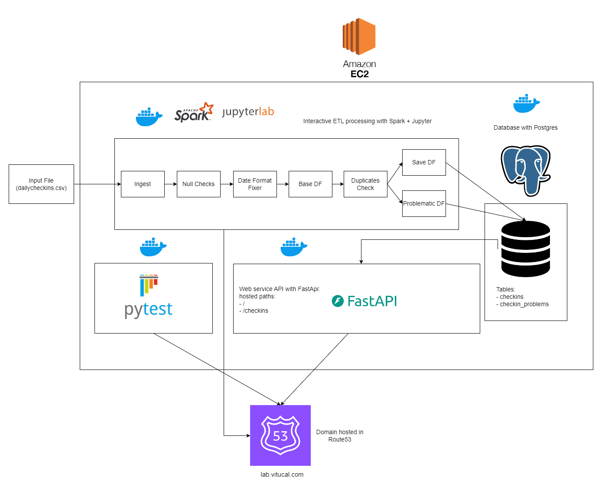

# Thinking Machines DE Take Home

## Introduction
Hi Team! I am <b>Vincent Itucal</b> and I am applying for the <b>PH - Data Engineer role</b> in <b>Thinking Machines</b>! \
I hope you find the solutions in my exam satisfactory and interesting. If ever I get selected for an interview here are some links that can be helpful in me sharing my solution to you guys interactively:
- http://lab.vitucal.com:8888/lab - Collaborative JupyterLab environment you can log into and interact/view the code with me, hosted as an EC2 instance in AWS and will be started when in the interview. I will also give the password in the interview. For steps in creating an environment like this please refer to my [medium article](https://blog.devgenius.io/2024-jupyter-lab-with-pyspark-hosted-in-aws-ec2-03509f72f3bd?source=friends_link&sk=f131d396b8850ea9d2864fe26b263854)
- http://lab.vitucal.com/checkins - I will host the fastapi server here to return check-in data for a given user and other paths.
- http://lab.vitucal.com:4040/jobs/ - Spark UI
- http://lab.vitucal.com:8000 - Unittest htmlcov
- http://lab.vitucal.com/docs, http://lab.vitucal.com/redoc - API Docs

All of the links above is accessible if my EC2 instance is up. By default they are not to save costs on my behalf on my AWS Personal Account. Hoping to meet you guys in the interview! Thank you!

## Directory Structure
- `images` - auxilliary images + drawio file of the architecture
- `Part 1` - part 1 of take home
    - `primes.ipynb` - Markdown of problem + solution + references
- `Part 2` - part 2 of take home
    - `ETL+webserver.ipynb` - notebook with markdowns explaining how I ETL'd the source dataset and how to setup the webserver API
    - `env_sample` - what your `.env` personal file should look like
    - `app` - fastapi source code in fetching per user filtered view of check-ins
        - `models` - pydantic dataclasses
        - `repository` - handler for postgres using psycopg2
        - `logger` - logging utilities
        - `main.py` - entrypoint
    - `tests` - tests for fast api app, details and screenshots of tests in `ETL+webserver.ipynb` under Appendix Section.
    - `scripts` - dockerfiles and scripts to build, start and cleanup
      
## Take Home Exam Architecture
- Everything is hosted on an EC2 instance on my Personal AWS Account
    - Interactive ETL with Spark + Jupyter (I would do EMR if I wasn't so cheap but in this usecase a single EC2 instance will suffice)
    - Database hosting with Postgres
    - Web server API with Fast API
- Domain is hosted via Route53 and routed to the Elastic Public IP Domain of the EC2 instance with select ports exposed via security groups

## For more info about me
Checkout my website: https://vitucal.com